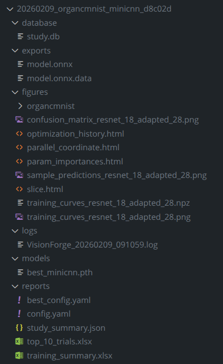

# 🔮 VisionForge: Type-Safe Deep Learning Framework

---

<!-- Badges Section -->
<table align="center">
<tr>
<td align="right"><strong>CI/CD & Coverage</strong></td>
<td>
  <a href="https://github.com/tomrussobuilds/visionforge/actions/workflows/ci.yml"></a>
  <a href="https://codecov.io/gh/tomrussobuilds/visionforge"></a>
  <a href="https://sonarcloud.io/summary/new_code?id=tomrussobuilds_visionforge"></a>
  <a href="https://sonarcloud.io/summary/new_code?id=tomrussobuilds_visionforge"></a>
</td>
</tr>
<tr>
<td align="right"><strong>Code Quality</strong></td>
<td>
  <a href="https://sonarcloud.io/summary/new_code?id=tomrussobuilds_visionforge"></a>
  <a href="https://sonarcloud.io/summary/new_code?id=tomrussobuilds_visionforge"></a>
  <a href="https://sonarcloud.io/summary/new_code?id=tomrussobuilds_visionforge"></a>
  <a href="https://sonarcloud.io/summary/new_code?id=tomrussobuilds_visionforge"></a>
  <a href="https://sonarcloud.io/summary/new_code?id=tomrussobuilds_visionforge"></a>
</td>
</tr>
<tr>
<td align="right"><strong>Tech Stack</strong></td>
<td>
  
  <a href="https://pytorch.org/"></a>
  <a href="https://docs.pydantic.dev/"></a>
  <a href="https://optuna.org/"></a>
</td>
</tr>
<tr>
<td align="right"><strong>Code Style</strong></td>
<td>
  <a href="https://github.com/psf/black"></a>
  <a href="https://pycqa.github.io/isort/"></a>
  <a href="https://flake8.pycqa.org/"></a>
  <a href="https://mypy-lang.org/"></a>
  <a href="https://radon.readthedocs.io/"></a>
</td>
</tr>
<tr>
<td align="right"><strong>Project</strong></td>
<td>
  <a href="https://docs.pytest.org/"></a>
  
  
  <a href="LICENSE"></a>
  
  <a href="https://github.com/tomrussobuilds/visionforge/issues"></a>
</td>
</tr>
</table>

---

## 📌 Table of Contents

- [🎯 Overview](#-overview)
- [⚡ Hardware Requirements](#-hardware-requirements)
- [🚀 Quick Start](#-quick-start)
- [📊 Experiment Management](#-experiment-management)
- [📚 Documentation Hub](#-documentation-hub)
- [📚 Citation](#-citation)
- [🗺 Development Roadmap](#-development-roadmap)
- [📄 License](#-license)

---

## 🎯 Overview

**VisionForge** is a research-grade PyTorch training framework engineered for reproducible, scalable computer vision experiments across diverse domains. Built on [MedMNIST v2](https://zenodo.org/records/6496656) medical imaging datasets and expanded to astronomical imaging ([Galaxy10 DECals](https://zenodo.org/records/10845026)), it provides a domain-agnostic platform supporting multi-resolution architectures (28×28 to 224×224+), automated hyperparameter optimization, and cluster-safe execution.

**Key Differentiators:**
- **Type-Safe Configuration Engine**: Pydantic V2-based declarative manifests eliminate runtime errors
- **Zero-Conflict Execution**: Kernel-level file locking (`fcntl`) prevents concurrent runs from corrupting shared resources
- **Intelligent Hyperparameter Search**: Optuna integration with TPE sampling and Median Pruning
- **Hardware-Agnostic**: Auto-detection and optimization for CPU/CUDA/MPS backends
- **Audit-Grade Traceability**: BLAKE2b-hashed run directories with full YAML snapshots

**Supported Architectures:**

| Resolution | Architectures | Parameters | Use Case |
|-----------|--------------|-----------|----------|
| **28×28** | ResNet-18-Adapted | ~11M | Transfer learning baseline |
| **28×28** | MiniCNN | ~94K | Fast prototyping, ablation studies |
| **224×224** | EfficientNet-B0 | ~4.0M | Efficient compound scaling |
| **224×224** | ViT-Tiny | ~5.5M | Patch-based attention, multiple weight variants |

---

## ⚡ Hardware Requirements

### CPU Training (28×28 Only)
- **Supported Resolution**: 28×28 **only**
- **Time**: ~2.5 hours (ResNet-18-Adapted, 60 epochs, 16 cores)
- **Time**: ~10 minutes (MiniCNN, 60 epochs, 16 cores)
- **Architectures**: ResNet-18-Adapted, MiniCNN
- **Use Case**: Development, testing, limited hardware environments

### GPU Training (All Resolutions)
- **28×28 Resolution**: 
  - MiniCNN: ~2-3 minutes (60 epochs)
  - ResNet-18-Adapted: ~5 minutes (60 epochs)
- **224×224 Resolution**: 
  - EfficientNet-B0: ~30 minutes per trial (15 epochs)
  - ViT-Tiny: ~25-35 minutes per trial (30 epochs)
- **VRAM**: 8GB recommended for 224×224 resolution
- **Architectures**: All (ResNet-18-Adapted, MiniCNN, EfficientNet-B0, ViT-Tiny)

> [!WARNING]
> **224×224 training on CPU is not recommended** - it would take 10+ hours per trial. High-resolution training requires GPU acceleration. Only 28×28 resolution has been tested and validated for CPU training.

**Representative Benchmarks** (RTX 5070 Laptop GPU):

| Task | Architecture | Resolution | Device | Time | Notes |
|------|-------------|-----------|--------|------|-------|
| **Smoke Test** | MiniCNN | 28×28 | CPU/GPU | <30s | 1-epoch sanity check |
| **Quick Training** | MiniCNN | 28×28 | GPU | ~2-3 min | 60 epochs |
| **Quick Training** | MiniCNN | 28×28 | CPU (16 cores) | ~30 min | 60 epochs, CPU-validated |
| **Transfer Learning** | ResNet-18-Adapted | 28×28 | GPU | ~5 min | 60 epochs |
| **Transfer Learning** | ResNet-18-Adapted | 28×28 | CPU (16 cores) | ~2.5h | 60 epochs, CPU-validated |
| **High-Res Training** | EfficientNet-B0 | 224×224 | GPU | ~30 min | 15 epochs, **GPU required** |
| **High-Res Training** | ViT-Tiny | 224×224 | GPU | ~25-35 min | 30 epochs, **GPU required** |
| **Optimization Study** | EfficientNet-B0 | 224×224 | GPU | ~2h | 4 trials (early stop at AUC≥0.9999) |
| **Optimization Study** | Various | 224×224 | GPU | ~1.5-5h | 20 trials, highly variable |

>[!Note]
>**Timing Variance**: Optimization times are highly dependent on early stopping criteria, pruning configuration, and dataset complexity:
>- **Early Stopping**: Studies may finish in 1-3 hours if performance thresholds are met quickly (e.g., AUC ≥ 0.9999 after 4 trials)
>- **Full Exploration**: Without early stopping, 20 trials can extend to 5+ hours
>- **Pruning Impact**: Median pruning can save 30-50% of total time by terminating underperforming trials

---

## 🚀 Quick Start

### Step 1: Environment Setup
```bash
# Clone and install dependencies
git clone https://github.com/tomrussobuilds/visionforge.git
cd visionforge
pip install -r requirements.txt
```

### Step 2: Verify Installation (Optional)
```bash
# Run 1-epoch sanity check (~30 seconds, CPU/GPU)
# Downloads BloodMNIST 28×28 by default
python -m tests.smoke_test

# Note: You can skip this step - forge.py will auto-download datasets as needed
```

### Step 3: Training Workflow

VisionForge uses `forge.py` as the **single entry point** for all workflows. The pipeline behavior is controlled entirely by the YAML configuration:

- **Training only**: Use a `config_*.yaml` file (no `optuna:` section)
- **Optimization + Training**: Use an `optuna_*.yaml` file (has `optuna:` section)
- **With Export**: Add an `export:` section to your config

#### **Training Only** (Quick start)

```bash
# 28×28 resolution (CPU-compatible)
python forge.py --config recipes/config_mini_cnn.yaml              # ~2-3 min GPU, ~10 min CPU
python forge.py --config recipes/config_resnet_18_adapted.yaml     # ~15 min GPU, ~2.5h CPU

# 224×224 resolution (GPU required)
python forge.py --config recipes/config_efficientnet_b0.yaml       # ~30 min GPU
python forge.py --config recipes/config_vit_tiny.yaml              # ~25-35 min GPU
```

**What happens:**
- Dataset auto-downloaded to `./dataset/`
- Training runs for 60 epochs with early stopping
- Results saved to timestamped directory in `outputs/`

---

#### **Hyperparameter Optimization + Training** (Full pipeline)

```bash
# 28×28 resolution - fast iteration
python forge.py --config recipes/optuna_mini_cnn.yaml              # ~5 min GPU, ~10 min CPU
python forge.py --config recipes/optuna_resnet_18_adapted.yaml     # ~5-10 min GPU

# 224×224 resolution - requires GPU
python forge.py --config recipes/optuna_efficientnet_b0.yaml       # ~1.5-5h*, GPU
python forge.py --config recipes/optuna_vit_tiny.yaml              # ~3-5h*, GPU

# *Time varies due to early stopping (may finish in 1-3h if target AUC reached)
```

**What happens:**
1. **Optimization**: Explores hyperparameter combinations with Optuna
2. **Training**: Full 60-epoch training with best hyperparameters found
3. **Artifacts**: Interactive plots, best_config.yaml, model weights

**View optimization results:**
```bash
firefox outputs/*/figures/param_importances.html       # Which hyperparameters matter most
firefox outputs/*/figures/optimization_history.html    # Trial progression
```

---

#### **Model Export** (Production deployment)

All training configs (`config_*.yaml`) include ONNX export by default:
```bash
python forge.py --config recipes/config_efficientnet_b0.yaml
# → Training + ONNX export to outputs/*/exports/model.onnx
```

To disable export, remove the `export:` section from your config. To customize:
```yaml
export:
  format: onnx           # or "torchscript", "both"
  opset_version: 18      # ONNX opset (18 = latest, no warnings)
  quantize: true         # Optional: INT8 quantization
  validate_export: true  # Verify PyTorch ↔ ONNX consistency
```

For advanced export options (quantization, validation settings), see the [Export Guide](docs/guide/EXPORT.md).

---

## 📊 Experiment Management

Every run generates a complete artifact suite for total traceability. Both training-only and optimization workflows share the same `RunPath` orchestrator, producing BLAKE2b-hashed timestamped directories.

<table>
<tr>
<td valign="top">

</td>
<td valign="top">

> [!IMPORTANT]
> ### 📂 [View Sample Artifacts](./docs/artifacts)
> Explore Excel reports, YAML configs, and diagnostic plots from real experiments.

**[Artifact Reference Guide](docs/guide/ARTIFACTS.md)** - Complete documentation of all generated files.

</td>
</tr>
</table>

---

## 📚 Documentation Hub

Comprehensive guides for advanced usage and system internals:

### 🏗️ Framework Design
**[Framework Guide](docs/guide/FRAMEWORK.md)**
- Core features and technical design principles
- System architecture diagrams
- Dependency relationships
- Component deep-dives (Config engine, Infrastructure safety, Reproducibility)

### 🧠 Model Architecture
**[Architecture Guide](docs/guide/ARCHITECTURE.md)**
- Supported models (ResNet-18 Adapted, MiniCNN, EfficientNet-B0, ViT-Tiny)
- Weight transfer and grayscale adaptation
- Training regularization (MixUp)

### ⚙️ Configuration & Customization
**[Configuration Guide](docs/guide/CONFIGURATION.md)**
- Complete parameter reference
- Usage patterns and best practices
- Extending to new datasets (zero-code integration)

### 🎯 Hyperparameter Optimization
**[Optimization Guide](docs/guide/OPTIMIZATION.md)**
- Optuna integration details
- Search space configuration
- Pruning strategies
- Visualization and result analysis

### 🐳 Containerization
**[Docker Training Guide](docs/guide/DOCKER.md)**
- Container build instructions
- GPU-accelerated execution
- Strict reproducibility mode

### 📤 Model Export
**[Export Guide](docs/guide/EXPORT.md)**
- ONNX export for production deployment
- Quantization for mobile/server
- Validation and benchmarking

### 🗂️ Artifact Reference
**[Artifact Guide](docs/guide/ARTIFACTS.md)**
- Complete file documentation
- Directory structure examples
- Training vs optimization outputs

### 🧪 Testing & Quality
**[Testing Guide](docs/guide/TESTING.md)**
- Test suite organization (nearly 1,000 tests)
- Quality check automation (`check_quality.sh`)
- Smoke tests and health checks
- CI/CD pipeline details

### 📦 Package Internals
**[orchard/ Package Documentation](orchard/README.md)**
- Internal architecture principles
- Package structure and module responsibilities
- Extension points for developers

**[tests/ Package Documentation](tests/README.md)**
- Test organization and categories
- Running specific test suites
- Coverage reporting

## 📚 Citation

```bibtex
@software{visionforge2026,
  author = {Tommaso Russo},
  title  = {VisionForge: Type-Safe Deep Learning Framework},
  year   = {2026},
  url    = {https://github.com/tomrussobuilds/visionforge},
  note   = {PyTorch framework with Pydantic configuration and Optuna optimization}
}
```

---

## 🗺 Development Roadmap

### ✅ Phase 1: Foundation (Completed)
- Architecture adaptation (3×3 stem, MaxPool removal)
- Pydantic-based configuration engine
- Infrastructure safety (flock, process management)

### ✅ Phase 2: Automation (Completed)
- YAML-driven execution model
- Optuna hyperparameter optimization
- Multi-resolution support (28×28, 224×224)
- Comprehensive test suite (nearly 1,000 tests, 100% coverage)
- CI/CD pipeline with GitHub Actions

### ✅ Phase 3: Modern Architectures (Completed)
- **Vision Transformer (ViT-Tiny)**: Patch-based attention with 3 weight variants
- **MiniCNN**: Compact baseline for rapid prototyping (~50K parameters)
- **Weight Variant Search**: Automatic exploration of ImageNet-1k/21k pretraining strategies

### ✅ Phase 4: Quality Assurance & Multi-Domain Support (Completed)
- **Test Coverage**: 100% across nearly 1,000 tests (unit, integration, smoke)
- **Artifact Export**: HTML visualizations (parameter importance, optimization history, slices, parallel coordinates)
- **Comprehensive Reporting**: Excel summaries, JSON metadata, YAML snapshots
- **Multi-Domain Architecture**: Medical imaging (MedMNIST v2) + Astronomical imaging (Galaxy10 DECals)
- **Domain-Specific Converters**: HDF5 to NPZ pipeline for non-standard formats

### ✅ Phase 5: Production Deployment (Completed)
- **ONNX Export**: Model serialization for production deployment (opset 18, clean export with no warnings)
- **Quantization Support**: INT8 quantization for mobile (qnnpack) and server (fbgemm) deployment
- **Validation Pipeline**: Numerical consistency verification between PyTorch and ONNX models
- **Export Configuration**: Type-safe Pydantic schema for export parameters

### 🎯 Current Status
- **Test Coverage**: 100% across nearly 1,000 tests (minimal pragma for defensive guards)
- **Architectures**: 4 total (2 for 28×28, 2 for 224×224)
  - 28×28: ResNet-18-Adapted, MiniCNN
  - 224×224: EfficientNet-B0, ViT-Tiny
- **Resolutions**: 2 (28×28, 224×224)
- **Domains**: Medical imaging (MedMNIST v2), Astronomical imaging (Galaxy10 DECals)
- **Export Formats**: PyTorch (.pth), ONNX (.onnx), HTML visualizations, Excel reports

### 🔮 Future Enhancements (Roadmap)
- **Additional Architectures**: ConvNeXt, EfficientNet-V2, DeiT
- **Expanded Dataset Domains**: Climate, remote sensing, microscopy
- **Multi-modal Support**: Detection, segmentation hooks
- **Distributed Training**: DDP, FSDP support for multi-GPU

> **Development Philosophy**: 
> Incremental feature addition with maintained test coverage. New capabilities are added carefully to preserve the framework's stability and reproducibility guarantees.


---

## 📄 License

MIT License - See [LICENSE](LICENSE) for details.

## 🤝 Contributing

Contributions welcome! Please:
1. Fork the repository
2. Create a feature branch
3. Add tests for new functionality
4. Ensure all tests pass: `pytest tests/ -v`
5. Submit a pull request

For detailed guidelines, see [CONTRIBUTING.md](CONTRIBUTING.md).

## 📧 Contact

For questions or collaboration: [GitHub Issues](https://github.com/tomrussobuilds/visionforge/issues)